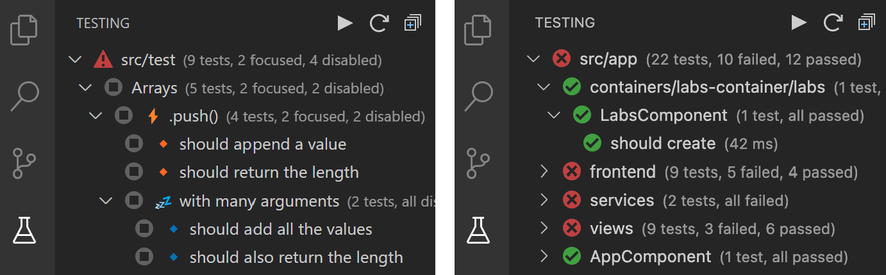

# Karma Test Explorer (for Angular, Jasmine, and Mocha)

This extension runs your Karma or Angular tests in Visual Studio Code using the [Test Explorer UI](https://marketplace.visualstudio.com/items?itemName=hbenl.vscode-test-explorer), and supports the Jasmine and Mocha test frameworks. It is based on [Angular/Karma Test Explorer](https://github.com/Raagh/angular-karma_test-explorer), with various significant [enhancements](./docs/documentation.md#why-this-extension).

It displays rich information about your tests in the Testing side bar (left image), including focused ⚡and disabled 💤 tests. It also detects duplicated tests in your project and convniently flags them for action. Test results summary, including passed, failed and skipped tests, are displayed in the side bar after each test execution (right image).

---
Please take a minute to rate this extension in the [marketplace](https://marketplace.visualstudio.com/items?itemName=lucono.karma-test-explorer) and star it on [GitHub](https://github.com/lucono/karma-test-explorer/stargazers). For issues, questions, or feature requests, see [Reporting Issues](./docs/documentation.md#reporting-issues).

---

## Features

- Angular and Karma project support
- Jasmine and Mocha framework support
- Watch mode with active pass-fail test updates
- Detect and flag duplicated tests
- Filter view to focus on only enabled tests
- Option to run tests in a visible browser window
- [More](./docs/documentation.md#features)

## Quick Start

Karma Test Explorer uses reasonable defaults, and in many cases will work out-of-the-box without any configuration. To quickly get started:

- Ensure Chrome browser and the project dependencies are installed
- Install the Karma Test Explorer [extension](https://marketplace.visualstudio.com/items?itemName=lucono.karma-test-explorer) and wait a moment for it to initialize
- Your tests should then be discovered and displayed in the Testing side bar

  
&nbsp;Additional Steps

- If you run into any issues or your tests are not automatically displayed in the Testing view, see [extension setup](./docs/documentation.md#extension-setup) for more detailed setup instructions
- Optionally, also use the many other [extension settings](./docs/documentation.md#extension-settings) to further customize it to the specific needs of your project and team

---
See the detailed [documentation](./docs/documentation.md#documentation---karma-test-explorer) for setting up Karma Test Explorer to work with your project.

---

## Acknowledgement

Special thanks to the [author](https://github.com/Raagh) and contributors of the [Angular/Karma Test Explorer](https://github.com/Raagh/angular-karma_test-explorer) extension on which Karma Test Explorer is based.

## See Also

- [Documentation](./docs/documentation.md#documentation---karma-test-explorer)
- [Contributing](./CONTRIBUTING.md#contributing---karma-test-explorer)
- [Changelog](./CHANGELOG.md#changelog)
- [Report an issue](./docs/documentation.md#reporting-issues)
