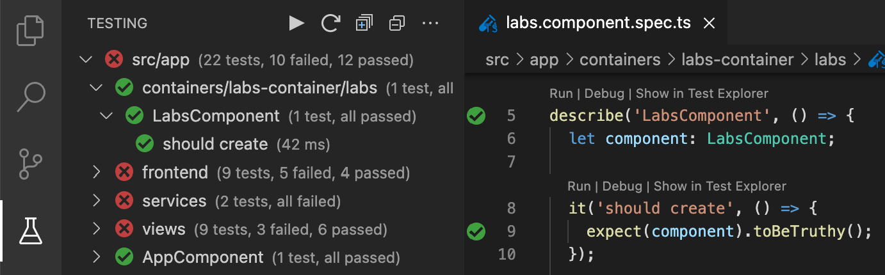

# DEPRECATION &nbsp;NOTICE

# With the [deprecation](https://github.com/karma-runner/karma#karma-is-deprecated-and-is-not-accepting-new-features-or-general-bug-fixes) of Karma runner, Karma Test Explorer is now also deprecated. It will no longer be releasing any new features or bug fixes.

# Karma Test Explorer (for Angular, Jasmine, and Mocha)

This extension adds a rich and fully integrated testing experience to Visual Studio Code for Angular, TypeScript, and JavaScript projects that use [Karma](https://karma-runner.github.io/latest/index.html) for testing.

It shows your Karma tests in a visual explorer in VS Code, adds code lenses and gutter decorations to your test files, and shows test failure details inline within your code at the point of each failure.

The side bar shows rich information about your tests, including focused ⚡ and disabled 💤 tests (left image), and details summarizing passed, failed and skipped tests after each test execution (right image).

---
Please take a minute to rate this extension in the [marketplace](https://marketplace.visualstudio.com/items?itemName=lucono.karma-test-explorer) and star it on [GitHub](https://github.com/lucono/karma-test-explorer/stargazers). For issues, questions, or feature requests, see [Reporting Issues](docs/documentation.md#reporting-issues).

---

## Why this Extension

Karma Test Explorer is a complete rewrite of the deprecated [Angular/Karma Test Explorer](https://github.com/Raagh/angular-karma_test-explorer), and adds various significant enhancements and new features to provide robust support for:

- Cloud and remote development sceanarios with [Dev Containers](https://code.visualstudio.com/docs/remote/containers)
- Good performance with large projects having many thousands of tests
- Zero-configuration user experience that "just works" for most setups
- Flexibility to support a wide range of testing scenarios and workflows
- Reliability, usability, and productivity

## Features

- Rich visual test browsing, execution, and debugging
- Angular, Karma, Jasmine, and Mocha support
- Multi-project / monorepo / multi-root workspace support
- Live test validation of changing product code
- Auto-detection and fix recommendations for various testing issues
- [Much more](docs/documentation.md#features)

## Quick Start

In many cases, testing should work out of the box:

- Ensure Chrome browser and the project dependencies are installed
- Install the Karma Test Explorer [extension](https://marketplace.visualstudio.com/items?itemName=lucono.karma-test-explorer) and wait a moment while it initializes
- When done, your tests should be displayed in the Testing side bar
- Use the many [extension settings](docs/documentation.md#extension-settings) to customize it to any other needs of your project
- If you run into any issues, see [extension setup](docs/documentation.md#extension-setup) for more detailed setup instructions

## Documentation

For a more detailed guide on setting up, customizing, and fully leveraging all the available features to work for your project, please see the Karma Test Explorer [Documentation](docs/documentation.md#documentation---karma-test-explorer).

## Acknowledgement

Special thanks to the authors of the deprecated [Angular/Karma Test Explorer](https://github.com/Raagh/angular-karma_test-explorer) on which Karma Test Explorer was originally based.

## See Also

[Documentation](docs/documentation.md#documentation---karma-test-explorer) &nbsp;|&nbsp; [Contributing](CONTRIBUTING.md#contributing---karma-test-explorer) &nbsp;|&nbsp; [Changelog](CHANGELOG.md#changelog) &nbsp;|&nbsp; [Report an issue](docs/documentation.md#reporting-issues)
