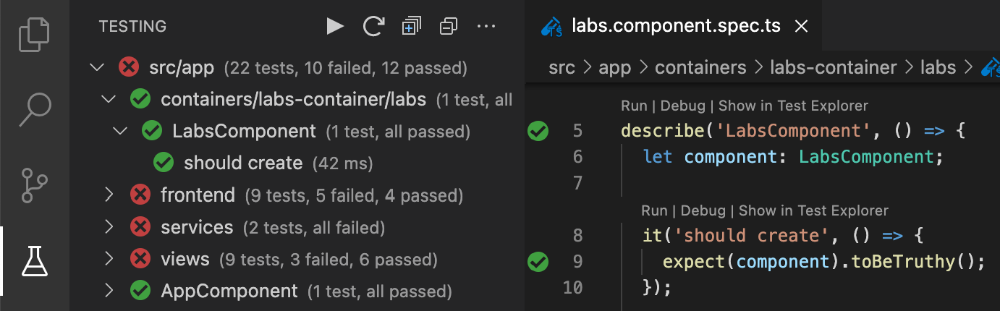
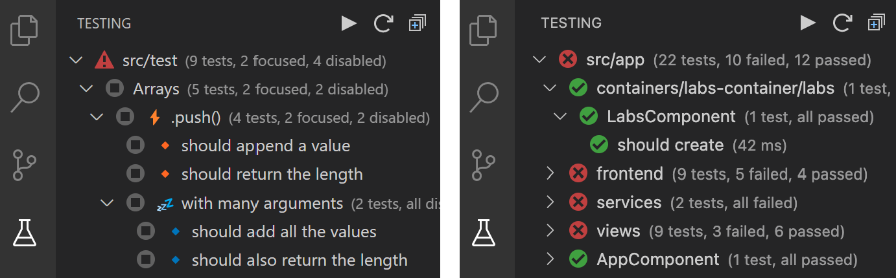

# Documentation - Karma Test Explorer

## Contents

- [Overview](#overview)
- [Why this Extension](#why-this-extension)
- [Features](#features)
- [Extension Setup](#extension-setup)
- [Extension Activation Rules](#extension-activation-rules)
- [Project Types](#project-types)
- [Test Frameworks](#test-frameworks)
- [Extension Settings](#extension-settings)
- [Specifying Test Files](#specifying-test-files)
- [Specifying a Test Framework](#specifying-a-test-framework)
- [Non-Headless Testing](#non-headless-testing)
- [Testing in a Development Container](#testing-in-a-development-container)
- [Output Panels](#output-panels)
- [Known Issues and Limitations](#known-issues-and-limitations)
- [Reporting Issues](#reporting-issues)
- [See Also](#see-also)

---

## Overview

Karma Test Explorer shows your Karma tests in a visual explorer in VS Code, adds code lenses and gutter decorations to your test files, and shows test failure details inline within your code at the point of each failure.



Rich information about your tests will be displayed in the Testing side bar, including focused ⚡and disabled 💤 tests (left image below). Test results summary, including passed, failed and skipped tests, are displayed in the side bar after each test execution (right image below).



Duplicated tests in your project are also detected and convniently flagged for action.

---

## Why this Extension

Karma Test Explorer is based on the [Angular/Karma Test Explorer](https://github.com/Raagh/angular-karma_test-explorer) extension and is a major rewrite aimed at facilitating various significant enhancements and new features (such as some of those in the initial release [changelog](../CHANGELOG.md#010---sep-28-2021)). 

Its core focus is on robust support for:

- Large projects with thousands of tests
- Remote development sceanarios with [Dev Containers](https://code.visualstudio.com/docs/remote/containers)
- Flexibility to support a wide range of testing scenarios and workflows
- Simplicity to "just work" - without any or much configuration
- Reliability, usability, and team productivity

---

## Features

### Core Features

- Angular and Karma project support
- Jasmine and Mocha test framework support
- Karma version 6 support
- Watch mode support with auto pass / fail test status update
- Duplicate test detection and reporting
- Non-Headless testing / use visible browser window
- Show only focused tests or exclude disabled tests from the test view
- Group and run tests by folder or by test suite
- Support for [Dev Containers](https://code.visualstudio.com/docs/remote/containers)
- Specify or override environment variables for Karma
- Run tests using custom launchers defined in the Karma config
- Auto-reload Karma when karma config or other specified files change
- Support for using a custom Karma executable or script (enables greater automation and integration with other processes and workflows)
- Automatic port management prevents any port conflicts when running tests

### UI Features

- Shows your Karma tests in a visual test explorer in VS Code
- Adds code lenses to your test files to easily run individual tests or suites
- Adds gutter decorations to your test files that show the status of each test
- Adds line decorations that show the failure message at the point of each test failure within your code

<a href="#contents"></a>

---

## Extension Setup

### 1. Install Prerequisites

|Prerequisite | Description|
|:-------------|------------|
|Test&nbsp;Browser | Karma Test Explorer requires a browser for running tests, which by default is the Chrome browser, though you can provide a custom launcher which uses a different browser. Whichever browser is used must be installed on the computer or container where VS Code will be running your project's tests|
|Test&nbsp;Frameworks | The various frameworks required for your project's tests must be installed. This can include for instance, some of Angular, Karma, Jasmine, Mocha, Karma-Jasmine, Karma-Mocha, etc, all of which will usually be defined as Dev dependencies in your project's package.json file, so that simply running `npm install` would ensure they are all installed|
|Karma&nbsp;Test&nbsp;Explorer | The Karma Test Explorer [extension](https://marketplace.visualstudio.com/items?itemName=lucono.karma-test-explorer) must be installed and enabled in VS Code. If developing and testing your project in a container, then the extension's installation mode in VS Code should be in the remote workspace|

### 2. Configure Extension

|Description&nbsp;&nbsp;&nbsp;&nbsp;&nbsp;&nbsp;&nbsp;&nbsp;&nbsp;&nbsp;&nbsp;&nbsp;&nbsp;&nbsp;&nbsp;&nbsp;&nbsp; | When&nbsp;Required | Config&nbsp;Setting
|:-------|---------------|----------------
|Specify project root path relative to the workspace folder | If the root path of the project is not the same as the VS Code workspace root folder | `karmaTestExplorer.projectRootPath`
|Specify `karma.conf.js` file path relative to the project root folder | If the `karma.conf.js` file has a different filename, or is not located in the project root folder | `karmaTestExplorer.karmaConfFilePath`
|Specify project [test files](#specifying-test-files) | Always recommended, for better performance | `karmaTestExplorer.testFiles`
|Provide any other relevant [settings](#extension-settings) | Optional but recommended - use the various other Karma Test Explorer configuration [options](#extension-settings) to further customize it to the needs of your project and team| See [all settings](#extension-settings)

### 3. Run Your Tests

When done configuring the extension, select the Karma Test Explorer prompt to __Apply Settings__ and wait a moment while it refreshes. You can also simply reload VS Code to apply the changes if you don't see the prompt.

After Karma Test Explorer is done refreshing with the updated settings, your tests should show up in the Test View, as well as code lenses above each test in the code editor, either of which can be used to run and debug the tests.
  
---

Note that Karma Test Explorer will briefly display updates (using available space if any) on the VS Code status bar, showing the current status of test operations. You can click on the status bar message to display additional options or show the extension log.

<a href="#contents"></a>

---

## Extension Activation Rules

The Karma Test Explorer extension is activated for a project workspace or folder based on the presence of any one of the following conditions:

- The project workspace has the `karmaTestExplorer.enableExtension` setting set to `true`. This setting is a maunal override of the extension's automatic activation rules to forcefully activate or deactivate the extension
- The project workspace has one or more Karma Test Explorer extension settings (`karmaTestExplorer.*`) configured, except for `karmaTestExplorer.enableExtension` set to `false`
- The project declares a `karma` dev dependency in its `package.json` file

<a href="#contents"></a>

---

## Project Types

Karma Test Explorer supports both [Karma](http://karma-runner.github.io/) and [Angular](https://angular.io/) projects, and is usually able to automatically detect which type your project is based on the presence of certain standard configuration files associated with specific project types. If the right project type is not automatically detected, you can use the `karmaTestExplorer.projectType` setting to explicitly specify a different type for your project.

### Karma Projects
Projects which DO NOT have an `angular.json` or `.angular-cli.json` file in the project root are loaded as plain Karma projects. Use the various [extension options](#extension-settings) where necessary to then customize Karma Test Explorer's behavior to the specific needs of your project and team.

### Angular Projects

Projects with an `angular.json` or `.angular-cli.json` file in the project root are loaded as Angular projects. Use the `karmaTestExplorer.defaultAngularProjectName` setting to specify which configured Angular project should be loaded for testing. Otherwise, the project specified as default in the `angular.json` config will be chosen.

Note that if no angular config file is found for a project that is explicitly configured as an Angular project using the `karmaTestExplorer.projectType` setting, then the project will be loaded instead as a plain Karma project.

<a href="#contents"></a>

---

## Test Frameworks

Karma Tesk Explorer supports both the [Jasmine](https://jasmine.github.io/) and [Mocha](https://mochajs.org/) test frameworks, and is usually able to automatically detect which one is in use by your project. It is therefore usually not necessary to manually specify the test framework in the Karma Test Explorer settings unless the right framework is not automatically detected, in which case you can use the `karmaTestExplorer.testFramework` config option to specify the right framework.

In the case of the Mocha test framework, the same setting can also be used to specify the Mocha testing interface style (BDD or TDD) that is used by your project.

---
Note that watch mode is currently not supported for the Mocha test framework.

<a href="#contents"></a>

---

## Extension Settings

Though Karma Test Explorer comes with many configuration options that make it flexible to adapt to a wide range of project setups and testing workflows, you may not need to set any of the options as the defaults are designed to work for most projects out of the box. If required however, customizing some of the options to the specific needs of your project may help you get even more out of it for your project and team.

Setting                                       | Description
-----------------------------------------------|---------------------------------------------------------------
`karmaTestExplorer.enableExtension` | Explicitly enables or disables Karma Test Explorer when its default project inspection to automatically enable or disable itself does not yield the desired decision
`karmaTestExplorer.projectRootPath` | The working directory where the project is located (relative to the root folder)
`karmaTestExplorer.projectType` | The type of the project. This will be auto-detected if not specified. Specify the right project type if not correctly auto-detected
`karmaTestExplorer.defaultAngularProjectName` | Only applies to Angular projects. This is the default Angular project to be loaded for testing. If not specified, the default project specified in `angular.json` is loaded instead
`karmaTestExplorer.testFramework` | The test framework used by the project. The framework will be auto-detected if none is specified. Specify the right test framework if it is not correctly auto-detected
`karmaTestExplorer.karmaConfFilePath` | The path where the `karma.conf.js` file is located (relative to `projectRootPath`)
`karmaTestExplorer.testGrouping` | How tests should be grouped in the Test view side bar
`karmaTestExplorer.flattenSingleChildFolders` | Flattens paths consisting of single child folders when using folder-based test grouping
`karmaTestExplorer.showTestDefinitionTypeIndicators` | Show test definition type indicators such as tests defined as focused or disabled
`karmaTestExplorer.excludeDisabledTests` | Exclude disabled tests from the test view
`karmaTestExplorer.showOnlyFocusedTests` | Show only focused tests in the test view. This is always true if using the Mocha test framework
`karmaTestExplorer.showUnmappedTests` | Include tests in the test view which were returned by Karma but either not discovered or included in the set of test files configured for Karma Test Explorer
`karmaTestExplorer.karmaPort` | The port to be used for the Karma server in VS Code
`karmaTestExplorer.browser` | The browser that will be launched by Karma for testing. This can also include any valid custom launcher defined in the Karma config file. This takes precedence over the `customLauncher` setting
`karmaTestExplorer.customLauncher` | Specify the karma custom launcher configuration for launching the test browser, similar to a custom launcher entry in a karma config file
`karmaTestExplorer.autoWatchEnabled` | Enables automatic re-run of tests when the files change
`karmaTestExplorer.autoWatchBatchDelay` | The delay in milliseconds when autoWatch is enabled for batching multiple file changes into a single rerun. This is the same as Karma config's `autoWatchBatchDelay` option and overrides it when set
`karmaTestExplorer.nonHeadlessModeEnabled` | Enables non-headless testing so that the browser UI is displayed when running tests. Has no effect when running in a container, or when the default value of the `customLauncher` or `browser` config settings are overridden
`karmaTestExplorer.allowGlobalPackageFallback` | Allows use of global install of Karma or Angular if available and there is no local install in the project folder
`karmaTestExplorer.env` | Additional environment variables to be set when running the tests. These override the values of the same variables if also provided through the `envFile` setting
`karmaTestExplorer.envFile` | Path to a dotenv file containing environment variables to be set when running the tests
`karmaTestExplorer.karmaProcessCommand` | The command or path to an executable to use for launching Karma. This is useful for using a custom script or different command other than the default
`karmaTestExplorer.angularProcessCommand` | The command or path to an executable to use for launching or running Angular tests. This is useful for using a custom script or different command other than the default
`karmaTestExplorer.testTriggerMethod` | Experimental. Specifies how test runs are triggered by default, either through the Karma CLI or Http interface. You will usually not need to use this setting unless working around specific issues
`karmaTestExplorer.failOnStandardError` | Treats any Karma, Angular, or other testing stderr output as a failure. This can sometimes be useful for uncovering testing issues
`karmaTestExplorer.testsBasePath` | The base folder containing the test files (relative to `projectRootPath`)
`karmaTestExplorer.testFiles` | The path glob patterns identifying the test files (relative to `projectRootPath`)
`karmaTestExplorer.excludeFiles` | The path glob patterns identifying files to be excluded from `testFiles` (relative to `projectRootPath`)
`karmaTestExplorer.reloadOnKarmaConfigChange` | Enables reloading of Karma on changes to the Karma configuration file
`karmaTestExplorer.reloadOnChangedFiles` | The files which when modified will trigger a Karma reload
`karmaTestExplorer.karmaReadyTimeout` | The duration in milliseconds after which the extension will stop listening and give up if Karma is not started, connected to the extension, and ready for testing
`karmaTestExplorer.defaultSocketConnectionPort` | This is the port that will be used to connect Karma with the test explorer. When not specified, Karma Test Explorer will automatically use the first available port equal to, or higher than, 9999
`karmaTestExplorer.debuggerConfigName` | The name of the launch configuration that will be used for debugging tests, which can be the name of any launch configuration defined or available in the VS Code `launch.json` file. This takes precedence over the `debuggerConfig` setting
`karmaTestExplorer.debuggerConfig` | The debugger configuration to be used in debugging the Karma tests in VS Code. This is similar to a VS Code launch configuration entry in the `.vscode/launch.json` file
`karmaTestExplorer.webRoot` | The web root to be used when debugging the Karma tests in VS Code. This takes precedence over the `webRoot` property in the `debuggerConfig` setting and supports using the `${workspaceFolder}` variable for the absolute workspace folder path. This setting is similar to the `webRoot` property of a VS Code launch configuration entry in the `.vscode/launch.json` file
`karmaTestExplorer.pathMapping` | The path mappings to be used when debugging the Karma tests in VS Code. These take precedence over any identical path mappings defined in the `debuggerConfig` setting and support using the `${webRoot}` variable for the configured `webRoot` value, and the `${workspaceFolder}` variable for the absolute path of the workspace folder. This setting is similar to the `pathMapping` property of a VS Code launch configuration entry in the `.vscode/launch.json` file
`karmaTestExplorer.sourceMapPathOverrides` | The source map path overrides to be used when debugging the Karma tests in VS Code. These take precedence over any identical source map path overrides defined in the `debuggerConfig` setting and support using the `${webRoot}` variable for the configured `webRoot` value, and the `${workspaceFolder}` variable for the absolute path of the workspace folder. This setting is similar to the `sourceMapPathOverrides` property of a VS Code launch configuration entry in the `.vscode/launch.json` file
`karmaTestExplorer.containerMode` | Enables additional support for easier testing when running in a container. Can be either `auto` (the default when not set), `enabled`, or `disabled`
`karmaTestExplorer.logLevel` | Sets the level of logging detail produced in the output panel of the extension. More detailed levels such as the `debug` level can be helpful when troubleshooting issues with running Karma or the extension
`karmaTestExplorer.karmaLogLevel` | Sets the level of logging detail for the Karma server in its output channel, which can be helpful when troubleshooting issues with running Karma or the extension
`karmaTestExplorer.karmaReporterLogLevel` | Sets the level of logging detail for the Karma Test Explorer reporter which logs additional details to the Karma server log related to the processing of test and browser events in Karma. This can be helpful when troubleshooting issues with how test and browser events are being processed in Karma and exchanged with the Karma Test Explorer. Set this to `disable` in order to not log any additional output from the reporter into the Karma server logs

<a href="#contents"></a>

---

## Specifying Test Files

By default, Karma Test Explorer searches for test files in every path under the project root directory (excluding `node_modules` directories). However, by explicitly specifying the location of your test files via the `karmaTestExplorer.testFiles` setting, you can reduce the amount of file scanning that's required to find your tests by limiting it to only the folders and files that actually contain the tests, which can significantly speed up discovery of your tests and improve the overall performance of your testing with the Karma Test Explorer.

### Default Test Discovery

The default test discovery behavior looks for tests in all files with the filename pattern `(test|spec)[._-]*` or `*[._-](test|spec)`, and having a `.js` or `.ts` file extension. For example, the following files would all be detected as test files by default, anywhere under the project root directory tree (except for the `node_modules` directory):

- `app.spec.ts`
- `app-test.js`
- `app-spec.ts`
- `app_spec.ts`
- `test.app.js`
- `spec.app.js`
- `test-app.ts`
- `spec_app.js`

### Customizing Test Discovery

You can change the default test discovery behavior by customizing test file detection to the specific name pattern and paths for your test files by using the `karmaTestExplorer.testFiles` extension setting, which accepts an array of file glob patterns that identify the locations of your test files.

For example:

```json
{
  "karmaTestExplorer.testFiles": [
    "src/test/**/test-*.js"
  ]
}
```

<a href="#contents"></a>

---

## Specifying a Test Framework

By default, when no test framework is specified (ie, the `karmaTestExplorer.testFramework` config option is not set), Karma Test Explorer will try to auto-detect the test framework that is used by your project by looking at its `karma.conf.js` file. If it detects the Mocha framework, it will by default assume the BDD style for the project. If your project uses Mocha with the TDD style instead, or if your project's test framework is not correctly detected for any other reason, you can explicitly specify the right framework by setting the `karmaTestExplorer.testFramework` config option, whicn can have one of the following values:

Value | Description
------|------------
`jasmine` | The Jasmine test framework
`mocha−bdd` | The Mocha test framework with the BDD-style interface which uses `describe` to define test suites and `it` to define test cases. This is the default assumed when Mocha is auto-detected as the test framework
`mocha−tdd` | The Mocha test framework with the TDD-style interface which uses `suite` to define test suites and `test` to define test cases

Most times however, you will not need to set this config option at all as Karma Test Explorer will be able to automatically detect the right test framework in use by your project. Note also that specifying a framework value that is different from the one actually in use by your project will usually result in your tests not being successfully discovered.

<a href="#contents"></a>

---

## Non-Headless Testing

Though by default Karma Test Explorer runs tests headlessly (using a headless instance of Chrome), it also has support for non-headless testing which can be enabled with the `karmaTestExplorer.nonHeadlessModeEnabled` setting. When this is enabled, the browser UI will be displayed when Karma Test Explorer is started, and you will be able to see your tests being executed in the browser.

Non-headless testing through the `nonHeadlessModeEnabled` setting is not supported in certain scenarios where non-headless usage would normaly not be possible, such as when running in a container. It is also not supported when the default value of the `customLauncher` or `browser` config settings have been overridden to use a non-Chrome browser, which is the default browser used by Karma Test Explorer. It is however supported in all other cases, including when running on WSLg (Windows Subsystem for Linux GUI) on Windows 11.

Also note that for regular headless testing, Karma Test Explorer supports any browser (Chrome or non-Chrome) with a Karma launcher implementation that is installed in the project, including Firefox, Edge, and others.

---

## Testing in a Development Container

With VS Code's Development Container feature, you can develop and run your project's Karma tests inside a container, using browsers installed in that container. However, launching Chrome and other Chromium browsers in a container environment often requires additional browser flags and other adjustments. Therefore, to fully support DevContainer-based setups and workflows, Karma Test Explorer provides a number of options to help make development and testing smoother and more seamless in those scenarios.

### Use `karmaTestExplorer.containerMode`

By default, Karma Test Explorer will automatically detect whether you are testing in a container environment, in which case it will activate `containerMode` which makes all necessary customizations required for smoother container-based development and testing. You can also manually enable this mode by setting the `karmaTestExplorer.containerMode` config setting to `enabled`. Because its default value when not set is `auto`, it should mostly not be necessary to manually set this option at all, unless in a situation where you are running in a container environment and find that Karma Test Explorer is not able to automatically detect it.

When in container mode, the adjustments made by Karma Test Explorer include internally applying the `--no-sandbox` flag when launching the default Chrome browser, unless either of the `karmaTestExplorer.browser` or `karmaTestExplorer.customLauncher` config options are also specified, in which case it is up to the user to ensure that the provided browser launcher is properly set up to successfully launch the associated browser in the container environment.

### Other Options for Testing in a Dev Container

If for any reason, using the `karmaTestExplorer.containerMode` setting is not a viable option for your project (for example, if you're using a different browser and need to apply a different set of browser flags, or if the `--no-sandbox` browser flag which is internally added by the `containerMode` option would break or conflict with other functionality or setup in your project's container environment), then you might still be able to leverage Karma Test Explorer's several other flexible options to successfully achieve a working VS Code test setup for your project within your container environment, depending on what's viable and desirable for your project and team.

#### Option 1 - Using `karmaTestExplorer.customLauncher`

With the `karmaTestExplorer.customLauncher` config option, you can provide a custom launcher definition directly in your VS Code settings that Karma Test Explorer will use for running your project's Karma tests. This makes it possible to provide a customized launcher for testing your project in VS Code without needing to modify your project's Karma config file to define a new launcher or adapt an existing one for running your project's tests.

In your VS Code project's settings file (`.vscode/settings.json`):

```json
{
  "karmaTestExplorer.customLauncher": {
    "base": "ChromeHeadless",
    "flags": [
      "--flag-required-in-my-container-environment",
      "--another-required-flag",
      "--yet-another-one"
    ]
  }
}
```

#### Option 2 - Using `karmaTestExplorer.browser`

With the `karmaTestExplorer.browser` config option, you can specify the name of any custom launcher definition that would normally be available to Karma for test execution in your project, including any that are defined in the `customLaunchers` property of your project's Karma config file. This makes it possible and easy to reuse any custom launcher defined in your Karma config file that's already properly configured to work in your project's container environment.

In your project's `karma.conf.js`:

```js
customLaunchers: {
  MyContainerBrowserThatWorks: {
    base: 'FirefoxHeadless',
    flags: [ '--launcher-flag-that-works' ]
  }
}
```

In your VS Code project's settings file (`.vscode/settings.json`):

```json
{
  "karmaTestExplorer.browser": "MyContainerBrowserThatWorks"
}
```

#### Option 3 - Using `karmaTestExplorer.env` or `karmaTestExplorer.envFile`

For more elaborate or highly custom project or environment setups that require a more intricate process for launching the test browser, the `karmaTestExplorer.env` and `karmaTestExplorer.envFile` config options make it possible to specify environment variables - such as `CHROME_PATH` and `CHROME_BIN` - which can point the Karma launcher to a custom script that can be used to provide any required prerequisites and perform whatever specific steps are required to launch the browser process or environment needed for running the tests.

<a href="#contents"></a>

---

## Output Panels

Karma Test Explorer adds the output channels described below to the Output panel of VS Code. Some or all of these channels can be disabled by setting their corresponding `logLevel` config option to `disable` in cases where this option is available.

Name | Description
-----|-------------
Karma&nbsp;Test&nbsp;Explorer | This output panel shows the logs of the Karma Test Explorer extension. The `karmaTestExplorer.logLevel` setting can be used to set the desired level of extension logging detail, with `trace` having the most detailed and verbose logging.
Karma&nbsp;Server | This output panel shows the Karma server log. The `karmaTestExplorer.karmaLogLevel` setting can be used to specify the desired level of logging detail from the Karma server, while the `karmaTestExplorer.karmaReporterLogLevel` setting can be used to specify the desired level of logging detail from Karma Test Explorer's Karma reporter plugin, whose output also appears in the Karma server log.

<a href="#contents"></a>

---

## Known Issues and Limitations

- Watch mode only works in the Test Explorer UI and doesn't currently work if the `testExplorer.useNativeTesting` config setting is used to disable the Test Explorer UI in favor of VS Code's native testing UI
- Watch mode is not yet supported for the Mocha test framework
- Test descriptions that are computed are currently not supported. Test descriptions must be plain string literals in order to be available in the Test view side bar. For example:
  ```ts
  // Supported
  it('supports plain literal test descriptions', ...
  it(`supports plain literal test descriptions`, ...

  // Not supported
  it('does not support computed ' + someValue + ' test descriptions', ...
  it(`does not support computed ${someValue} test descriptions`, ...
  ```

<a href="#contents"></a>

---

## Reporting Issues

If you encounter any problems using Karma Test Explorer, would like to request a feature, or have any questions, please open an issue [here](https://github.com/lucono/karma-test-explorer/issues/new/choose). Also, please take a minute to rate the extension in the [marketplace](https://marketplace.visualstudio.com/items?itemName=lucono.karma-test-explorer) and star it on [GitHub](https://github.com/lucono/karma-test-explorer/stargazers).

<a href="#contents"></a>

---

## See Also

- [Readme](../README.md#karma-test-explorer-for-visual-studio-code)
- [Contributing](../CONTRIBUTING.md#contributing---karma-test-explorer)
- [Changelog](../CHANGELOG.md#changelog)
